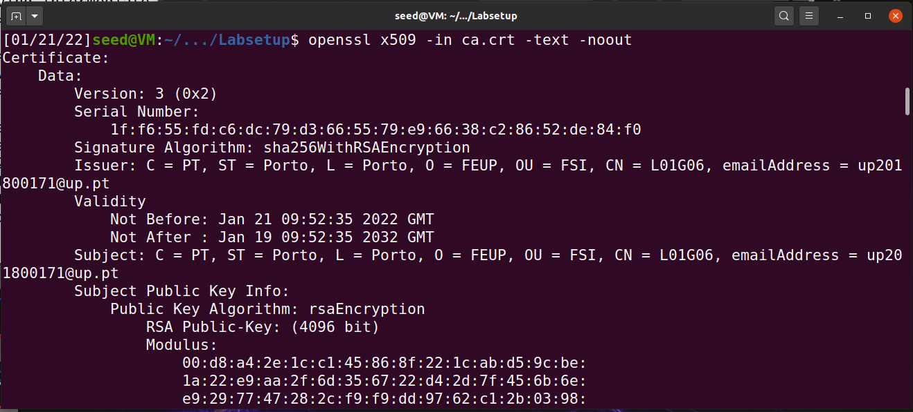
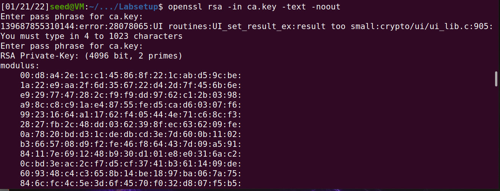
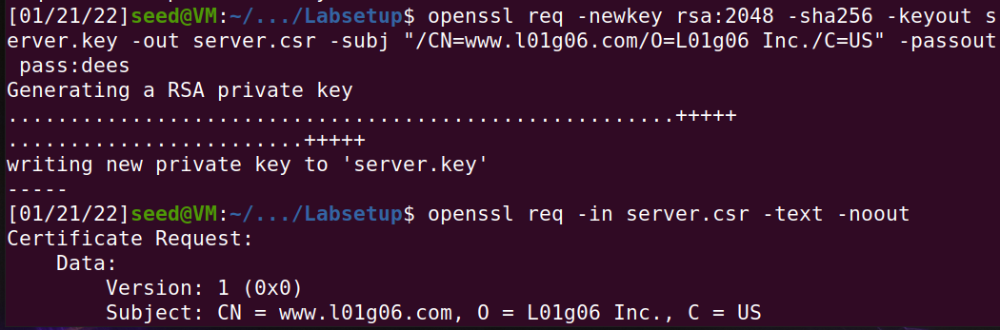
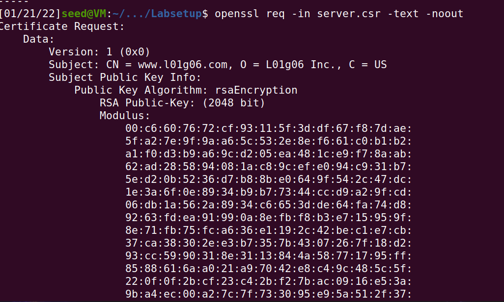
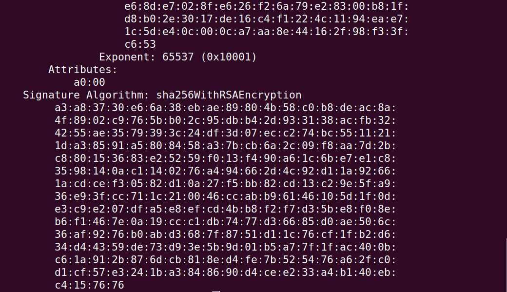
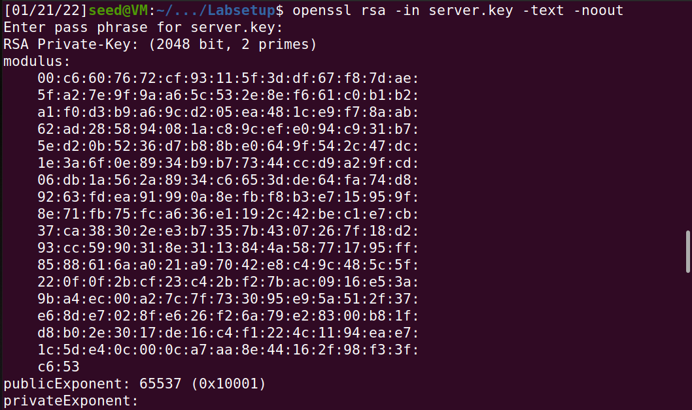
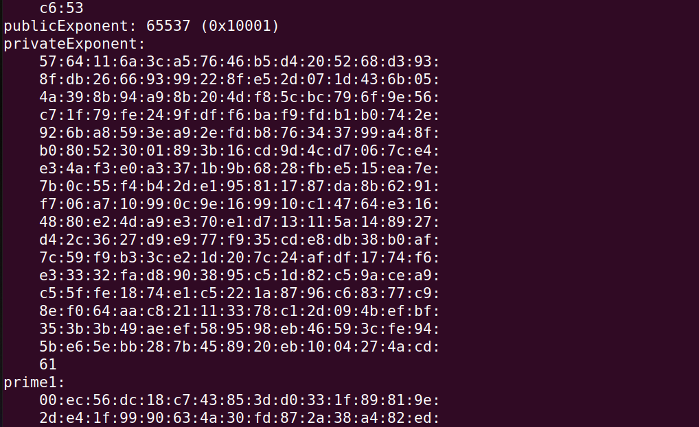
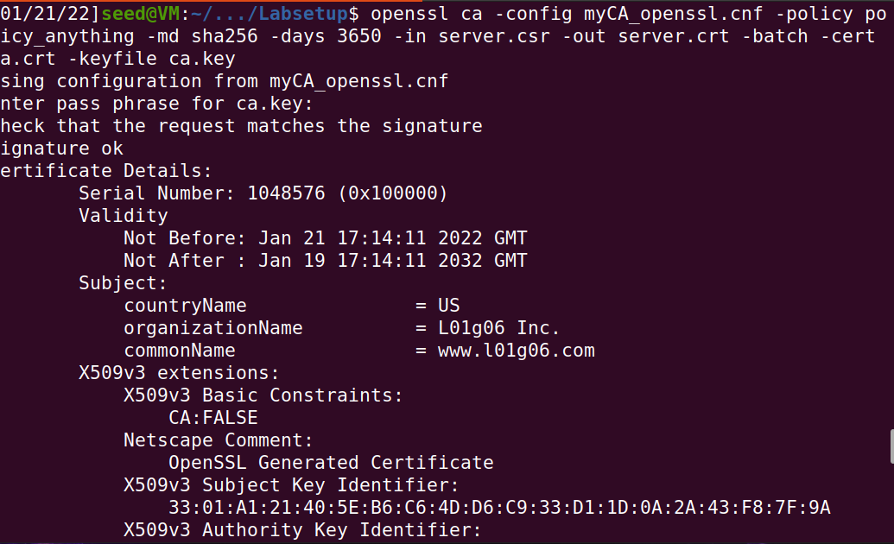
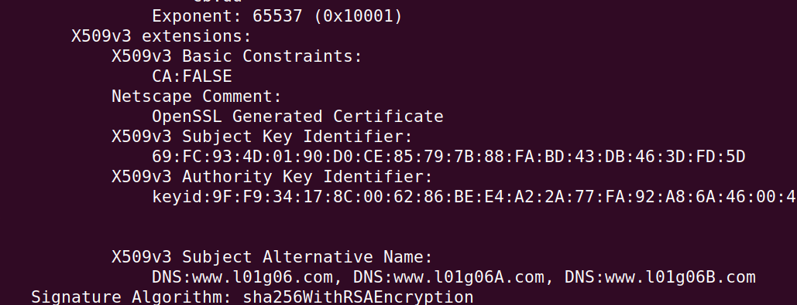

# Task 1

Para iniciar a tarefa, foram criados os ficheiros necessários (index.txt e serial) e o certificado de autorização, foram feitas também certas modificação no ficheiro openssl.cnf.
A seguir foram executados os comandos:

    openssl x509 -in ca.crt -text -noout

    openssl rsa -in ca.key -text -noout

 
 

Com o primeiro comando, verifica-se que  *subject* e  *issuer* são iguais, indicando que se trata de um certificado auto-assinado. É possível verificamos também que possui como basic constraint *CA : TRUE* , configurando um Certificado de Autorização.
Em seguida, foi pedido para identificar os valores para *public exponent e*,  *private exponent d*,  *modulus n*, e dois números secretos *p* e *q* tais que n = pq.

modulus:

    00:d8:a4:2e:1c:c1:45:86:8f:22:1c:ab:d5:9c:be:
    1a:22:e9:aa:2f:6d:35:67:22:d4:2d:7f:45:6b:6e:
    e9:29:77:47:28:2c:f9:f9:dd:97:62:c1:2b:03:98:
    a9:8c:c8:c9:1a:e4:87:55:fe:d5:ca:d6:03:07:f6:
    99:23:16:64:a1:17:62:f4:05:44:4e:71:c6:8c:f3:
    28:27:fb:2c:48:dd:03:62:39:8f:ec:63:62:09:fe:
    0a:78:20:bd:d3:1c:de:db:cd:3e:7d:60:0b:11:02:
    b3:66:57:08:d9:f2:fe:46:f8:64:43:7d:09:a5:91:
    84:11:7e:69:12:48:b9:30:d1:01:e8:e0:31:6a:c2:
    0c:bd:3e:ac:2c:f7:d5:cf:37:41:b3:61:14:09:de:
    60:93:48:c4:c3:65:8b:14:be:18:97:ba:06:7a:75:
    84:6c:fc:4c:5e:3d:6f:45:70:f0:32:d8:07:f5:b5:
    5a:7e:28:5e:16:76:6c:4e:22:ba:de:ab:1a:21:0c:
    be:77:0b:53:15:b7:4c:b7:0e:d1:35:8f:ce:46:f1:
    da:c9:4a:e6:68:27:e2:3e:0b:c3:9c:87:9b:6b:d0:
    76:28:58:6a:75:49:1d:39:60:31:c0:02:bc:e9:97:
    16:a1:1a:4c:56:0c:07:26:ca:66:21:fb:bd:d8:09:
    9a:c8:ad:1b:e7:56:c9:fe:56:3a:e2:66:39:a3:f7:
    71:9c:09:c3:cf:17:3c:24:81:a2:54:2c:f9:85:8b:
    96:6b:50:eb:d5:c6:c8:14:6e:75:6d:1c:ee:b5:14:
    88:55:60:01:b0:14:50:ec:c1:34:ba:99:ce:48:54:
    6d:6e:ca:36:f8:56:8b:02:91:e3:09:fd:87:30:d1:
    9c:7a:ca:82:ed:84:98:7f:ea:8e:6b:6c:d1:15:bb:
    a9:fd:c0:10:0b:b6:f8:42:13:3a:c1:a1:0f:8c:fc:
    03:f9:30:c7:7c:c9:a4:7f:ed:5b:d5:e1:87:27:68:
    1c:62:f9:7e:85:97:64:cc:32:46:89:ee:77:a0:28:
    fe:69:a4:24:29:00:8b:f7:e1:84:1b:f6:0e:8c:10:
    f0:e7:45:d1:dc:a0:47:f8:1f:e1:b3:c4:be:f7:77:
    d6:c8:a7:e5:a0:d4:19:88:79:2d:80:da:39:67:bf:
    4d:bb:db:ac:8f:dc:5b:43:1c:25:b0:53:ca:d0:05:
    f6:3d:d2:2a:5d:74:98:74:1c:03:98:cf:d7:fb:eb:
    af:bd:8b:a3:74:4f:a5:a8:e3:6d:aa:58:a8:b8:52:
    a5:f6:74:06:32:ba:ce:12:ee:83:d7:3c:52:00:6d:
    3e:dc:f6:4a:10:e0:41:83:1c:f8:1b:f1:d2:d6:d0:
    f6:df:a1

Public Exponent *e*: 65537 (0x10001)

Private Exponent *d*:

    00:b3:2c:de:c2:83:8a:f8:26:4b:85:41:0d:54:2c:
    da:3b:03:dc:f0:8a:b7:3f:4c:cc:05:b1:1c:7e:25:
    66:0c:18:8d:ae:89:bc:59:ce:ce:d5:2b:84:62:de:
    11:64:d1:ef:9a:21:66:59:56:82:05:d7:88:fc:3e:
    15:1b:b2:fa:99:4d:59:57:0f:40:16:4c:fd:75:37:
    ea:7f:5e:ba:9a:ac:c8:8e:a5:a3:06:54:90:12:49:
    9c:e9:0b:d3:53:d6:ad:ef:46:ca:27:31:97:15:83:
    91:52:d4:2b:0a:ef:71:24:cb:6d:49:70:11:d9:71:
    07:b4:dc:43:14:8f:37:33:4b:b9:f3:9b:f0:e3:26:
    09:19:3f:cb:71:09:ad:39:4b:af:38:27:d3:45:f2:
    39:17:b7:78:9d:4e:cf:7f:e1:55:3f:af:e8:89:c1:
    c6:3b:c9:53:74:22:05:74:7e:5a:fb:02:37:5b:1d:
    99:f1:7b:7b:8d:c2:76:03:0d:b0:56:57:57:2d:fc:
    77:4e:c7:fb:f8:9a:f8:84:f2:69:4f:8e:57:81:cf:
    a8:2f:11:96:8c:90:68:0a:fe:f9:d2:ed:49:3b:1b:
    57:8e:38:ca:1b:a4:d3:d9:cf:58:76:41:0d:73:78:
    b5:8b:9a:cf:85:df:3e:ce:f3:59:13:44:3d:18:7f:
    a1:16:4f:66:1d:85:57:9f:34:82:36:92:fc:6c:15:
    16:3c:76:61:e9:fe:48:6b:19:d1:e6:8d:dd:27:77:
    1a:fd:7b:c7:b4:ff:0e:5e:d2:47:5a:b3:74:8f:36:
    79:b2:ec:8a:e4:d7:7a:d6:a1:e0:48:f4:b6:be:bb:
    d4:bd:9b:9a:83:78:6b:1a:a6:2d:4d:45:62:88:3a:
    da:43:d5:03:96:af:0f:1f:e8:71:d6:68:0f:e5:a8:
    a2:91:67:43:f3:04:06:90:e1:ee:3b:68:d4:fa:13:
    6d:8a:07:64:53:b0:de:07:92:20:81:70:d1:f1:49:
    87:a7:53:f5:d0:0f:49:44:ae:08:74:26:bf:e8:7f:
    a8:df:8f:e9:14:f8:b9:73:b8:4b:37:a8:ab:c2:df:
    33:36:c7:af:be:d4:cc:2a:2b:d2:fc:bb:50:72:49:
    a6:5f:6e:a8:6e:65:20:01:a1:d7:f9:07:49:ad:15:
    05:53:3e:96:30:c0:86:fd:8c:28:21:e3:04:6e:4d:
    35:81:d1:a1:83:2b:c9:2a:73:5a:d5:ea:d9:e1:45:
    ec:64:b6:30:f3:f7:46:61:48:ca:66:fe:41:2f:5c:
    bd:f5:a0:60:ec:f5:7d:2c:76:7e:13:ba:04:17:0d:
    cb:49:25:26:42:8a:3b:b0:e4:57:16:17:af:c6:f0:
    bd:f2:41

 *p*:
 
    00:fe:fa:46:16:87:33:15:e0:9d:ed:51:68:8b:42:
    8f:f8:d5:3e:e2:44:d2:b5:7b:de:37:b2:07:d1:ee:
    e3:15:a4:33:c7:01:7d:93:20:b1:9c:e4:dd:cf:24:
    9d:56:73:98:56:3c:ff:b6:68:18:cf:0a:27:e3:c6:
    72:99:6a:ee:e8:dd:66:a1:c4:0b:49:e8:38:e8:9a:
    49:cf:f6:ba:ef:c1:68:92:19:1b:be:78:48:e6:b9:
    37:98:f1:55:13:7c:08:d3:e3:c5:2a:35:ff:a3:3d:
    a2:33:3c:bf:f5:02:f9:38:cb:86:c5:2c:13:31:64:
    c1:ed:22:29:ba:f7:d1:fc:32:19:94:6f:33:52:97:
    f2:da:3d:f1:a2:ec:50:51:91:0a:4b:dc:be:86:95:
    2c:9e:dc:2a:37:66:2b:71:8a:6e:60:58:d1:d7:42:
    d3:2c:92:dc:16:6b:d0:02:b3:2a:bc:7a:38:04:51:
    e4:2c:5e:80:31:b2:28:0d:27:42:07:39:b2:fe:4d:
    01:d8:0b:3d:ac:64:96:ff:e7:01:7e:fd:5c:68:cb:
    3b:dd:c1:23:b8:40:5b:cf:08:7a:41:75:21:4f:2b:
    7a:57:81:f6:fd:85:81:c0:c2:61:c1:42:89:1e:bf:
    d5:1c:37:f7:da:df:77:f2:b5:e7:e3:5d:53:7b:ca:
    92:c9
 

 *q*:
 
    00:d9:82:8e:2d:6c:ca:fa:11:60:92:b7:e1:f1:77:
    05:d9:07:62:b3:33:3a:91:95:d0:16:85:61:2b:37:
    6a:46:55:de:73:22:08:16:58:07:77:2e:7e:2a:c3:
    02:0a:67:f2:b6:67:8c:f4:52:b3:10:63:99:d7:78:
    2d:a2:48:fa:74:f6:88:1e:76:97:0c:39:a1:0d:7b:
    5a:00:51:30:a5:8a:a5:25:51:a7:46:25:9d:1c:ea:
    f2:18:a4:71:85:c6:61:31:2c:cd:b8:76:e4:e5:15:
    13:15:69:05:13:c2:7c:60:1b:5e:b4:5b:c9:72:57:
    2e:82:1d:14:86:4b:b7:e1:55:ad:36:0c:56:de:43:
    23:c7:4b:3b:67:9f:fb:a9:36:89:7e:02:4f:8a:73:
    ce:96:a0:0c:3f:6d:ab:c0:9e:3c:6b:fb:b8:99:f5:
    3b:af:1d:c0:b4:72:af:33:a5:0f:a5:e4:9c:11:53:
    d4:9b:16:a7:7d:04:d3:62:f5:eb:79:f5:3d:3b:a2:
    3a:df:07:6a:6b:00:98:36:91:89:1f:ef:2c:16:51:
    44:ea:4e:89:5c:50:72:4b:c6:14:b7:c3:68:18:85:
    c6:96:28:be:28:70:1c:e6:80:8f:2f:fe:80:30:ec:
    8a:f6:ef:88:1b:a9:03:ec:b1:d0:9d:76:53:bf:05:
    3a:19

# Task 2

Nessa task, foi dado o comando necessário para criar um CSR para o server www.l01g06.com. Após executa-lo, foi criado um par de chaves pública/privada. A seguir, utilizamos os comandos abaixo para ver o conteúdo do CSR e os ficheiros da chave privada.

 

``
openssl req -in server.csr -text -noout
``

``
openssl rsa -in server.key -text -noout
``

Em seguida, foi pedido para adicionarmos dois nomes alternativos para nosso certificate signing request. Isso foi feito através do comando:

``
openssl req -newkey rsa:2048 -sha256 
-keyout server.key -out server.csr 
-subj "/CN=www.l01g06.com/O=L01g06 Inc./C=US" 
-passout pass:dees -addext "subjectAltName = DNS:www.l01g06.com, DNS:www.l01g06A.com, DNS:www.l01g06B.com"
``

# Task 3

Nesta tarefa, nos foi dado o comando para transformar o certificate signing request em um X509 certificate usando o CA’s *ca.crt* e *ca.key*.
Foi preciso criar o diretorio *demoCA* e *newcerts* dentro do mesmo.

``
openssl ca -config myCA_openssl.cnf -policy policy_anything -md sha256 -days 3650 -in server.csr -out server.crt -batch -cert ca.crt -keyfile ca.key
``

A seguir, foi preciso alterar o ficheiro de configuração para podermos copiar o extension field do request para o certificado final. Para isso foi necessario, apenas descomentar o campo:

``
copy_extensions = copy 
``

Após assinar o certificado utilizamos o seguintes comando para printar o conteúdo do certificado, e ver que os nomes alternativos estão lá.

``
openssl x509 -in server.crt -text -noout
``

# Task 4
# Task 5
# Task 6
